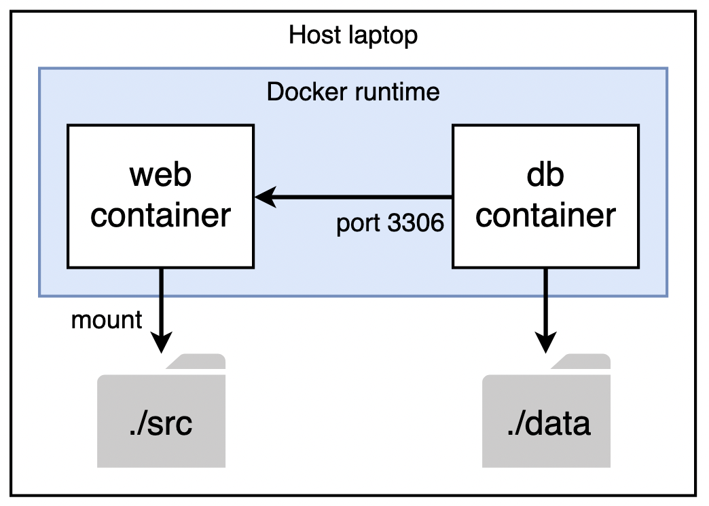

# Code<span>.org Docker Dev Environment
The Code<span>.org Docker dev environment enables you to develop on the Code<span>.org platform using Docker containers.

Doing so offers many advantages over a development environment directly on your laptop. These include:

- No need to worry about managing dependencies (e.g., setting up rbenv, managing versions of Ruby, or removing/installing Ruby gems).
- Rebuilding your development environment is scripted, which makes it easy to test new changes and roll them back, such as a new version of a Ruby gem or even a new version of MySQL. 
- It's easier to have multiple versions of the Code<span>.org dev environment and database on the same machine.
- A docker-based development environment works better for Code<span>.org volunteers, who may not want to install a bunch of our dependencies directly on their employer-provided machines.
- The docker-based environment uses Ubuntu, which mimics our production environment (and reduces the chance of things working on your laptop, but not on our production servers).
- When you are not developing, you can pause/stop the dev containers which frees up more resources on your machine.
- Rebuilding a container is a lot easier than rebuilding your laptop!

## How does it work?

The Code<span>.org Docker dev environment uses docker compose to create two containers: web and db. 

The web container runs all of the code required for dashboard and pegasus. All of the source code is stored on the host laptop under the "src" sub-directory.

The db container runs MySQL 5.7. All of the data files for MySQL are stored on the host laptop using the "data" sub-directory.

Docker networking provides a connection between the two containers. The db container exposes port 3306 for MySQL access to the web container.



## Pre-requisite: Docker Desktop
The only pre-requisite you need on your host laptop is Docker desktop.  If you don't have it already installed and running, you can download it [here](https://www.docker.com/products/docker-desktop/). 

If you are on a Linux machine, you can follow the instructions [here](https://docs.docker.com/desktop/install/linux-install/). Also, ensure you can run Docker as a non-root user, following [these instructions](https://docs.docker.com/engine/install/linux-postinstall/).

Note: This repo has been tested using Docker version 20.10.9.

To get everything setup, follow these three steps:

## Step 1: Build and run the containers
- Open a terminal and clone this repo:
	- ```git clone git@github.com:simonguest/codeorg-docker-dev.git```
- Within this directory, git clone the Code<span>.org repository as a sub-directory called src:
	- ```cd codeorg-docker-dev```
	- ```git clone git@github.com:code-dot-org/code-dot-org.git src```
- Edit src/Gemfile:
	- Remove mini_racer gem (I really don't think we use this any more)
	- Update unf_ext from 0.0.0.72 to 0.0.8
	- Add gem 'tzinfo-data' (this is required for db seeding in containers)
	- Add gems 'ruby-debug-ide' and 'debase' (required for debugging)
- Edit src/Gemfile.lock:
    - Update unf_ext from 0.0.7.2 to 0.0.8
- Edit src/config/development.yml.erb
	- Set db_writer to ```'mysql://root:password@db/'``` (this points the development environment to the db container vs. the local machine).
- Build the containers:
    - macOS host: ```docker compose build```
	- Linux host: ```FIXUID=$(id -u) FIXGID=$(id -g) docker compose build```
- Run the containers:
	- ```docker compose up```

If everything starts fine, you should see ```mysqld: ready for connections.``` You'll then need to open a new terminal window/tab to continue with the rest of the setup.

## Step 2: Configure AWS credentials
- Ensure $HOME/.aws on your host laptop contains valid AWS credentials. You probably already have this setup, but if you don't, you can find instructions [here](https://docs.google.com/document/d/1dDfEOhyyNYI2zIv4LI--ErJj6OVEJopFLqPxcI0RXOA/edit#heading=h.nbv3dv2smmks).
- Connect to the web container:
	- ```docker exec -ti web bash```
- Run the aws_access script:
	- ```cd /app/src```
	- ```bin/aws_access```
	- When prompted, copy and paste the URL into a separate browser window and copy the returned OAUTH_CODE to the clipboard.
- Set the OAUTH_CODE as an environment var:
	- ```export OAUTH_CODE=copied value```
	- (If you close the terminal window or restart the containers, you'll need to repeat this)

## Step 3: Seed the db, build, and run the server
- From the ```/app/src``` directory, rake install:
	- ```bundle exec rake install```
- Rake build:
	- ```bundle exec rake build```
- Run the dashboard server script:
	- ```bin/dashboard-server```
- Open a web browser and browse to http://localhost-studio.code.org:3000

## Optional: Running Tests
TBD

## Optional: Exposing MySQL (on port 3306) to the host
If you have a MySQL client on your host laptop (e.g., JetBrains Datagrip or SQLPro), you can also connect directly to the MySQL database running in the db container.

To do this, edit your docker-compose.yml file and add the following section in the db configuration:

```
ports:
  - "3306:3306"
```

Stop and restart the containers, and your db container will now be accessible on localhost:3306. Use the credentials specified in the docker-compose.yml file.

Note: The db container will fail to start if you already have an existing MySQL installation on your host laptop (as port 3306 will already be in use). To overcome this, either uninstall MySQL on the host, or bind to a port other than 3306:

```
ports:
  - "3307:3306"
```

## Optional: Run/Debug Dashboard and Pegasus (RubyMine)

To setup the remote Ruby SDK:

- Start containers, if they are not running, using `docker compose up`
- From RubyMine, open the "./src/dashboard" folder. Ignore the "missing gem dependencies" messages when RubyMine first starts.
- In RubyMine, go into preferences and navigate to the "Ruby SDK and Gems" settings.
- Click on the + button to create a new configuration and select "Remote Interpreter or Version Manager".
- Select the Docker Compose (not Docker!) radio button, point to the docker compose yml file (in the codeorg-docker-dev dir), and select the "web" as the image name. For the ruby path, enter "/home/cdodev/.rbenv/versions/2.6.6/bin/ruby".
- Click OK to create the remote Ruby SDK. RubyMine will list and synchronize the gems from the container.
- Click on the "Edit Path Mappings" icon. Create a new path mapping. Local src folder should map to "/app/src" on the container.
- Ensure that the "Remote: ruby" configuration is the default and click OK to exit preferences.
- RubyMine will now download and index the gems, which will take a few minutes to complete.
- Once complete, you will be able to navigate around the code base.

To create a new run/debug configuration:

- Create a new Rails run/debug configuration (or edit the current one if auto-created).
- In the rails configuration, make sure the "Thin" server is selected".
- Add the environment variable, "AWS_PROFILE=cdo"
- Select "Use other SDK" and select the Remote SDK from the container.
- Select docker-compose exec as the attach method (RubyMine will attach to the running container instead of creating a new one)
- Click on Run or Debug to start Dashboard. Browse to http://localhost:3000. Any breakpoints hit will drop back to the IDE.

## Optional: Run/Debug Dashboard and Pegasus (VS Code)

- Start containers, if they are not running, using `docker compose up`
- Ensure the [Docker extension](https://marketplace.visualstudio.com/items?itemName=ms-azuretools.vscode-docker) is installed.
- Click on the Docker icon in the sidebar and locate the "Containers" panel.
- Right click on the "codeorg-docker-dev-web" container and select "Attach Visual Studio Code". This will open a new VS Code Window, attached to the docker container.
- Open a terminal and follow step 2 above (to ensure you have a valid OAUTH_CODE set).
- If it is not already installed, add the [Ruby language extension](https://marketplace.visualstudio.com/items?itemName=rebornix.Ruby) to the remote VS Code instance.
- Create a new run/launch configuration using the following: 

```
{
  "version": "0.2.0",
  "configurations": [
    {
      "name": "Debug Dashboard",
      "type": "Ruby",
      "request": "launch",
      "program": "/home/cdodev/.rbenv/versions/2.6.6/bin/bundle",
      "args": ["exec", "thin", "start", "-a", "0.0.0.0", "-p", "3000"],
      "useBundler": true,
      "showDebuggerOutput": true,
      "cwd":"${workspaceRoot}/dashboard"
    }
  ]
}
```
- Click on the run "Debug Dashboard" button (or press F5) to start debugging.
- Set breakpoints in your code and browse to http://localhost:3000.

## Optional: Run/Debug Dashboard and Pegasus in a container running on a remote Linux host (VS Code)

Ensure that you can ssh into the remote host and it has Docker installed.

- Follow steps 1-3 above to copy the codedotorg-docker-repo to the remote host and start the containers.
- Install the Remote-SSH VS Code extension
- CTRL-Alt-P and Remote-SSH: Connect to host
- username@host:port (e.g., simon@remote:22)
- Once connected, follow the instructions as per above section (Run/Debug Dashboard and Pegasus using VS Code).

## Optional: Debugging web using WebStorm
TBD

## Optional: Speeding up zsh access to the ./src directory

If you are using [zsh](https://ohmyz.sh/), you may find your terminal is slow when in the ./src directory. This is due to the size of our repository and how zsh displays git info in it's prompt.

To disable git info in the prompt (and speed up the terminal), run the following command from the ./src directory:

- `git config oh-my-zsh.hide-info 1`

## FAQ

#### Q: If I delete the containers, does it delete any data?

No, all data resides on the host laptop and is mounted by the containers when they start. Source is kept in the ./src folder. MySQL database files are kept in the ./data folder.

#### Q: Does my IDE run in a container?

No, your IDE runs on your host laptop as normal.

#### Q: Where do I set my IDE to point to?

Use your preferred IDE to open the ./src folder - just as you would if you were developing on your host laptop. As this is a mounted volume in the web container, any changes are reflected immediately.

#### Q: Do I need to go through all these steps every time?

No, once the containers are created, you are all set! If you restart the containers, you'll need to generate and set a new OAUTH_CODE and restart the dashboard server.

#### Q: Can I pause containers?

Yes, you can use pause and unpause commands with Docker compose:

```
docker compose pause|unpause
```

#### Q: How do I rebuild my database?

All of the MySQL database files are held in the ./data directory. To rebuild the database from scratch, simply delete this folder, restart the containers, and run the seeding step again.

#### Q: I need to install a new Gem. How do I do this?

Edit src/Gemfile, connect to the Web container, and run bundle install:

```
docker exec -ti web bash
cd /app/src
bundle install
```

If you want this Gem to persist container restarts, rebuild the container:

```
docker compose build
```

#### Q: Is using Docker slower than developing on my laptop?

There should be little noticeable performance difference between developing using Docker and on your host laptop. Older versions of Docker used to have performance issues when mounting large volumes, but this has since been resolved with VirtioFS.

#### Q: Do I need to install Ruby and/or MySQL on my host laptop?

No! The only required dependency on the host laptop is Docker desktop.

#### Q: Does this work on Windows-based PCs?

It should, but this README needs to include the Windows-equivalent commands and/or how this would work with WSL. PRs welcome :)

#### Q: Does this work for M1-based Macs?

Yes, the dev environment works for both x86 and ARM64-based machines.

#### Q: Does this work for Linux-based PCs?

Yes. These instructions will also work for Linux-based server images (such as an EC2 instance running in AWS).
